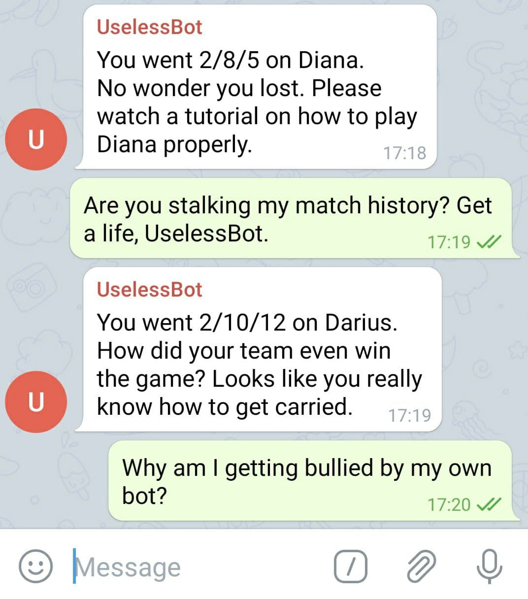

# GameTracker
The program GameTracker tracks the League of Legends matches of a given user. The performance of each match is 
evaluated. Based on the computed score of the performance, a Telegram bot will automatically send a message to the user. 

Use case: Track your friend's matches and automatically send some **friendly** banter if they don't have good
performances.

## Preface
The main goal of this project was for me to practice my newly acquired Kotlin skills.

## Prerequisites
- League of Legends
  - [Account](https://signup.euw.leagueoflegends.com/en/signup/index#/)
  - [API key](https://developer.riotgames.com/docs/portal)
- Telegram
  - [Bot](https://core.telegram.org/bots/faq#how-do-i-create-a-bot)
  - API key
  
## Steps
Note: The program runs on Windows and UNIX-based systems.
1. Add the Telegram bot to a Telegram chat. Find out the `chatId` of the chat. One way to do this is to invite 
   the bot "@getidsbot" to the chat.
2. Create the file `config.properties` under `src/main/resources`. The file [example/config.properties](example/config.properties)
   shows you which properties need to be provided.\
   Warning: Make sure to capitalize the property values correctly and remove any trailing whitespaces.
3. From the root directory of the project run `gradlew uberJar` (or `./gradlew uberJar` on a UNIX-based system).
4. Run `java -jar build\libs\GameTracker-1.0.jar`

## Comments about Program
- The program periodically fetches the new match history from the API server. If it finds any new matches that fit the 
  performance criteria, it sends a Telegram message. After that, the program sleeps until it fetches the new match 
  history again.
- The program stores the match history it previously fetched in files. That means even if it is shut down, it knows 
  where to start once it is launched again. This would make it a good candidate for a cron job. 
- The program only ever sends a message for 1 game after fetching new match history. This is to avoid spamming the 
  chats.